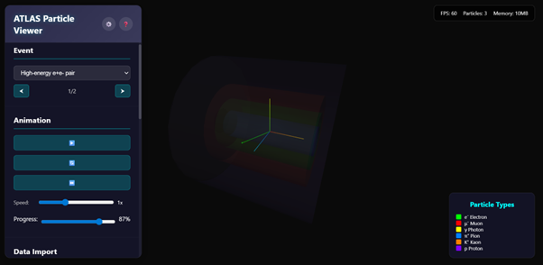

# ATLAS Particle Viewer

A browser-based, self-contained 3D particle collision event viewer inspired by CERN ATLAS Open Data. This project provides an interactive visualization of particle physics events with simplified detector geometry and animated particle trajectories, designed to run entirely in the browser without a build step or backend dependencies.

The focus of this project is clarity and accessibility: enabling users to explore particle tracks, detector layers, and basic kinematic behaviour using a lightweight, portable setup.

<p align="center">
  
</p>


## Overview

The ATLAS Particle Viewer visualizes particle collision events in a simplified ATLAS-like detector environment. It supports both embedded sample events and user-provided event data, allowing rapid experimentation and visualization without specialized software.

The application is implemented as a single HTML file with accompanying CSS and uses Three.js for rendering.


## Key Features

### Visualization
- Simplified ATLAS-style detector geometry including inner detector, calorimeters, and muon system
- Animated particle trajectories originating from the interaction point
- Color-coded particle tracks by particle type
- Coordinate axes for spatial reference

### Interactivity
- Camera orbit, pan, and zoom controls
- Play, pause, reset, and step-through animation controls
- Adjustable animation speed and progress
- Toggle visibility of detector layers and coordinate axes
- Switch between multiple events

### Data Support
- Embedded sample events for demonstration
- Upload custom event data in JSON format directly in the browser
- Immediate visualization of uploaded events without reloading the page

### Lightweight Design
- No build step or backend required
- Runs locally by opening the HTML file or using a simple static server
- Designed to run smoothly on standard laptops


## Getting Started

### Local Usage

Clone the repository:
```
git clone https://github.com/aarxshi/atlas-particle-viewer.git
cd atlas-particle-viewer
```
Open the viewer:
```
# Option 1: open directly
open visualization.html

# Option 2: serve locally (recommended for file uploads)
python -m http.server 8080
```
Then navigate to:
```
http://localhost:8080/visualization.html
```

## Project Structure
```
atlas-particle-viewer/
├── visualization.html   # Full self-contained application logic
├── styles.css          # UI and layout styling
└── README.md
```
Sample events are embedded directly in the HTML file for simplicity. Additional events can be loaded through the file upload interface.

## Event Data Format

Custom events can be uploaded in JSON format. Each event should contain a list of particles with trajectory points.

### Minimal JSON Example
```
{
  "event_id": "example-001",
  "description": "Sample event",
  "particles": [
    {
      "id": 1,
      "type": "electron",
      "charge": -1,
      "momentum": { "px": 25.3, "py": -8.5, "pz": 45.2, "E": 52.1 },
      "trajectory": [
        { "x": 0.0, "y": 0.0, "z": 0.0 },
        { "x": 0.4, "y": 0.2, "z": 0.1 },
        { "x": 1.2, "y": 0.6, "z": 0.3 }
      ]
    }
  ]
}
```
Only the particles array and trajectory points are required for visualization. Additional physics metadata may be included but is optional.

## Controls

### Mouse
- **Left drag**: Rotate view  
- **Right drag**: Pan view  
- **Scroll**: Zoom  

### Keyboard
- **R**: Reset camera  
- **U**: Toggle UI  
- **Space**: Play / pause animation  
- **A**: Toggle coordinate axes  

### User Interface
- Event selector and navigation  
- Animation controls and progress slider  
- Detector layer visibility toggles  
- File upload for custom event data  


## Scope and Limitations

This viewer is intended for visualization and exploratory purposes. Detector geometry and particle trajectories are simplified and are not meant to replace full reconstruction or analysis tools such as ROOT-based frameworks.

## License

This project is released under the MIT License.

## Acknowledgments

CERN ATLAS Collaboration for the Open Data initiative

Three.js for browser-based 3D rendering
